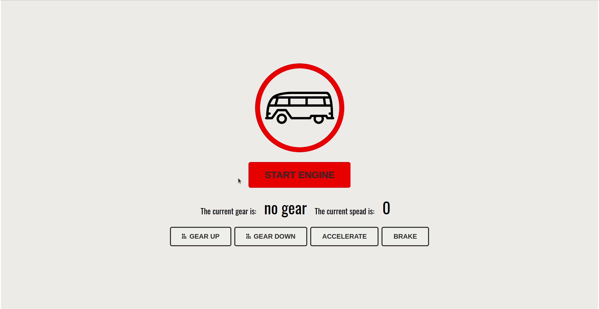

# Exercise :cartwheeling: useReducer 

## Lets build a little van using useReducer

Lets create a van interface using `useReducer`.
You don't need to make many different components, but your UI should have the following elements:

- "START ENGINE" button
    - When the button is clicked, the engine status text should display "ENGINE ON".
- "GEAR UP" button
    - When the button is clicked, and the engine is started, the current gear text should increment by 1 (max 4).
- "GEAR DOWN" button
    - When the "GEAR DOWN" button is clicked, and the engine is started, the current gear text should decrement by 1.
- "ACCELERATE" button
    - When the "ACCLERATE" button is clicked, and the engine is started and in a non-zero gear, the speed text should increment according to the current gear.

Your reducer function should be able to do the following actions:

- start the van engine
- stop the van engine
    - also resets gear to 0
    - does not change the van speed
- change engine gear up
    - only works if van is started
    - max gear 4
- change engine gear down
    - only works if van is started
- increase van speed
    - only works if van is started
    - if gear is 0, it has no effect
    - changes van speed so that it is further away from 0
    - gear 4 increases speed faster than gear 3
    - gear 3 increases speed faster than gear 2 etc. 
- decrease van speed
    - only works if van is started
    - if gear is 0, has no effect
    - changes van speed so that it is closer to 0

Show the current speed and gear of the van to the user. Show also buttons for the different actions

**BONUS CHALLENGE :weight_lifting: Show distance travelled**

